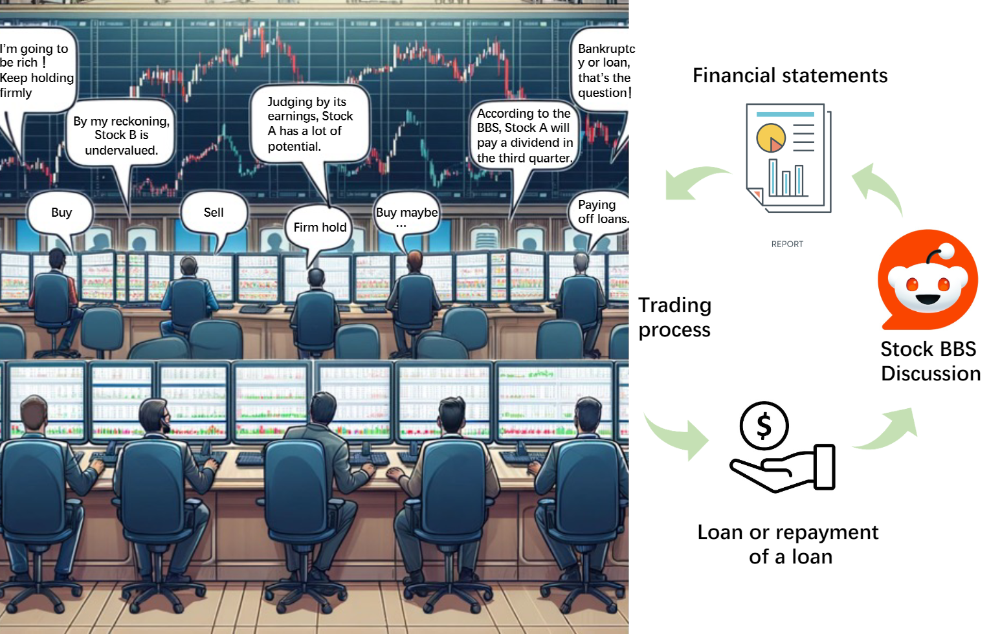
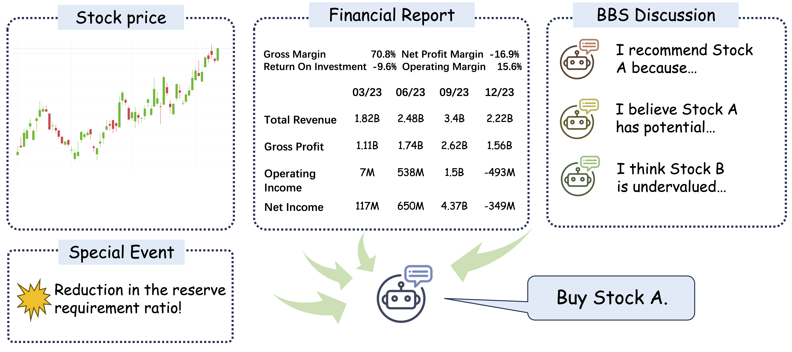
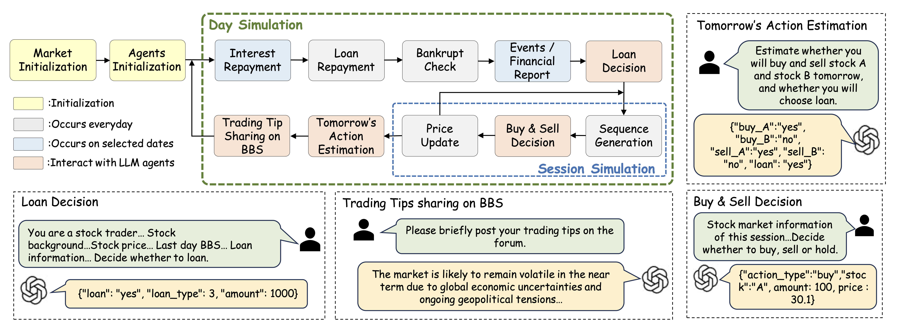

# Using a Large Language Model to Trade Stocks in Simulated Real-World Settings

<!-- 
 -->

Can AI agents create fake trading environments to see how things like macroeconomics, policy changes, company fundamentals, and global events affect stock trading?  These factors, which often affect how traders act, are very important in the search for ways to make investors the most money.  We try to solve this problem by using agents based on large language models.  StockAgent is a multi-agent AI system powered by LLMs that we created to mimic how investors trade in response to the real stock market.  The StockAgent lets users look at how different outside factors affect investor trading and look at how trading behaviour and profitability are affected.  StockAgent also doesn't have the problem of test set leakage that other AI Agent-based trading simulation systems do.  In particular, it stops the model from using any previous knowledge it may have gained about the test data.  We test different LLMs in a stock trading setting that is very similar to how things work in the real world.  The results of the experiment show how important outside factors are to stock market trading, such as how people trade and how stock prices change.  This research investigates the examination of agents' free trading gaps in a context devoid of prior knowledge pertaining to market data.  The patterns found in StockAgent simulations are useful for LLM-based stock recommendations and investment advice.

<!-- ## Link
ARXIV LINK: https://arxiv.org/pdf/2407.18957
## Architecture
 -->
<!-- 
The Workflow of Trading Simulation Flow. There are four Phases, namely **Initial Phase**, **Trading Phase**, **Post-Trading Phase** and **Special Events Phase**. In the Post-Trading Phase, Daily events and Quarterly events occur with daily and quarterly frequency respectively. A Specific Events Phase is an event that occurs randomly and acts on a random trading day.

## Quick Start

#### Environment

```
conda create --name stockagent python=3.9
conda activate stockagent

git clone https://github.com/dhh1995/PromptCoder
cd PromptCoder
pip install -e .
cd ..

git clone <This Github Project>
cd Stockagent
pip install -r requirements.txt
```

#### API keys

Use GPTs as agent LLM:

```
export OPENAI_API_KEY=YOUR_OPENAI_API_KEY
```

Use Gemini as agent LLM:

```
export GOOGLE_API_KEY=YOUR_GEMINI_API_KEY
```

#### Start simulation

You can choose a basic LLM and start simulation in one line:

```
python main.py --model MODEL_NAME
```

We set gemini-pro for default LLM.
```

 -->
